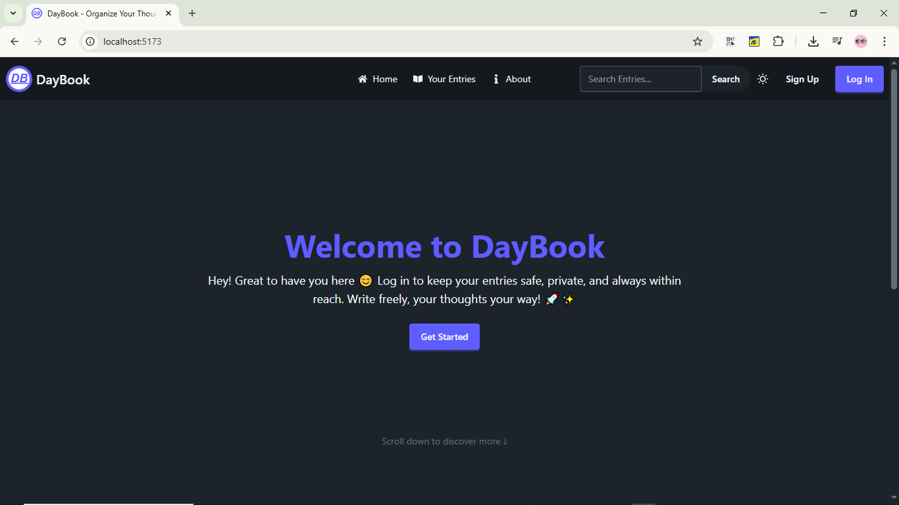

# DayBook

DayBook is a secure and user-friendly personal journaling app built with the MERN stack (MongoDB, Express, React, and Node.js). It allows users to easily log in, write, view, and manage their daily entries while ensuring a seamless, distraction-free, and private experience. Prioritizing simplicity, security, and privacy, DayBook helps you document your thoughts and memories with confidence and peace of mind.

[Live Demo](https://daybook-mern.vercel.app)



---


## 1. Features

- **User Authentication:** Secure login and registration system.
- **Journal Entries:** Create, read, update, and delete personal daily entries.
- **Responsive UI:** Built with React for a smooth user experience.
- **RESTful API:** Powered by Express and Node.js for backend operations.
- **Data Persistence:** MongoDB used to store user data and journal entries securely.

---

## 2. Tech Stack

- **Frontend**: React.js with TailwindCSS & DaisyUI for modern, responsive UI design.
- **Backend**: Node.js with Express.js for handling server-side logic and API requests.
- **Authentication**: JWT (JSON Web Tokens) with HTTP-only secure cookies for safe and efficient user authentication.
- **Database**: MongoDB with Mongoose for schema validation and seamless database interactions.
- **State Management & API Calls**: Redux Toolkit (RTK) and RTK Query for efficient state management, data fetching, and caching.
- **Deployment**: Vercel for seamless deployment and hosting of the live demo.

---

- **backend:** Contains all server-side code including API endpoints, middleware, and database connections.
- **frontend:** Contains all client-side code responsible for the user interface and client logic.

---

## 3. Installation

Follow these steps to set up the project locally:

### Prerequisites

- [Git](Github.com)
- [Node.js](https://nodejs.org/)
- [MongoDB](https://www.mongodb.com/)

### Backend Setup

1. **Clone the repository:**

   ```bash
   git clone https://github.com/PLP-MERN-Stack-Development/deployment-and-devops-essentials-SkimaniKings.git

   cd daybook/backend
   ```

2. **Install dependencies:**

   ```bash
   npm install
   ```

3. **Configure Environment Variables:**

   Create a `.env` file in the `backend` directory and set the variables accordingly:

   ```env
   PORT=3000
   MONGO_URI=mongodb://localhost:27017/daybook
   JWT_SECRET=rushB@5678
   FRONTEND_URL=http://localhost:5173
   ```

4. **Start the backend server:**

   ```bash
   npm start
   # or
   npm run dev
   ```

### Frontend Setup

1. **Navigate to the root directory (daybook, not backend):**

   ```bash
   cd frontend
   ```

2. **Install dependencies:**

   ```bash
   npm install
   ```

3. **Configure Environment Variable:**

   Create a `.env` file in the `frontend` directory and set the variable accordingly:

   ```
   VITE_BACKEND_URL=http://localhost:3000
   ```

4. **Start the React development server:**

   ```bash
   npm run dev
   ```

The app should now be running locally. `By default`:

- The frontend runs on [http://localhost:5173](http://localhost:5173)
- The backend runs on [http://localhost:3000](http://localhost:3000)

---

## 4. API Endpoints

| **Method** | **Endpoint**                | **Description**                                                                                                                                                                                          |
| :--------- | :-------------------------- | :------------------------------------------------------------------------------------------------------------------------------------------------------------------------------------------------------- |
| POST       | `/api/auth/signup`          | Registers a new user by saving their email and hashed password to the MongoDB database. After that a JWT token is returned and stored in an HTTP-only secured cookie, automatically logging the user in. |
| POST       | `/api/auth/login`           | Authenticates the user with their provided credentials (email and password). If successful, a JWT token is returned and stored in an HTTP-only secured cookie, providing access to protected resources.  |
| POST       | `/api/auth/logout`          | Logs out the user by setting the JWT token stored in the HTTP-only cookie as null and setting its expiration now, effectively invalidating the user's token cookie.                                      |
| GET        | `/api/users/me`             | Retrieves the current user's information (email, first name, last name) based on the authenticated session. This request requires the user to be logged in.                                              |
| PUT        | `/api/users/me`             | Allows the logged-in user to update their personal details, such as first name, last name, while keeping the rest of their account intact.                                                               |
| PUT        | `/api/auth/change-password` | Enables the user to change their password. The request requires both the old password (for verification) and the new password, updating the password in the database after successful verification.      |
| POST       | `/api/entries`              | Adds a new entry to the database. The request body must include the necessary details for the entry (date, title, mood, content). Only authenticated users can add entries.                              |
| GET        | `/api/entries`              | Retrieves all entries stored in the database. This is typically used by the user to view a list of all their entries. Requires the user to be authenticated.                                             |
| GET        | `/api/entries/:id`          | Retrieves a specific entry based on its unique ID. The ID should be passed as a parameter in the URL, and only the entry corresponding to that ID will be returned.                                      |
| PATCH      | `/api/entries/:id`          | Updates an existing entry specified by its ID. The request body must include the fields that need to be updated (date, title, mood, content). Only the owner of the entry can modify and see it.         |
| DELETE     | `/api/entries/:id`          | Deletes the entry specified by its ID. Only the user who created the entry is authorized to delete or see it. The entry will be permanently removed from the database.                                   |
| GET        | `/api/entries/search?text=` | Searches for entries that match the given search text in either the title or the description. The search query parameter text should contain the keyword(s) you want to search for.                      |

---
